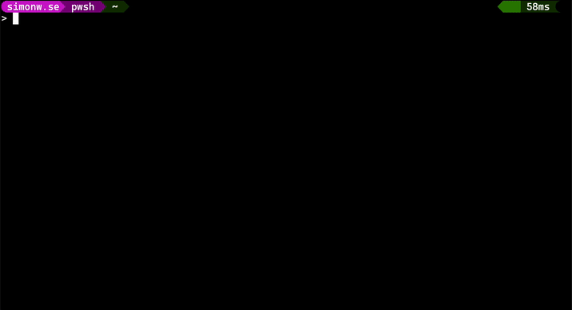

# StageCoder

A PowerShell module for awesome on-stage terminal demos!

This module makes it possible to type out a command in the terminal, character by character, by pressing any button. The perfect tool for people showing code on stage, in a classroom, or a workshop.



## Installation
```powershell
Install-Module -Name StageCoder
```

## Example
```powershell
Set-Demo -Demo @'
Set-Demo -Demo '"With StageCoder I can type any c0mpl3X sentence without fear of typos while talking on stage"', 'Import-Module -Name StageCoder', 'Get-Command -Module StageCoder', 'Get-Help -Name Set-Demo' -Timing Manual -Chord 'Ctrl+d'
'@
Set-PSreadLineOption -PredictionSource None
```
